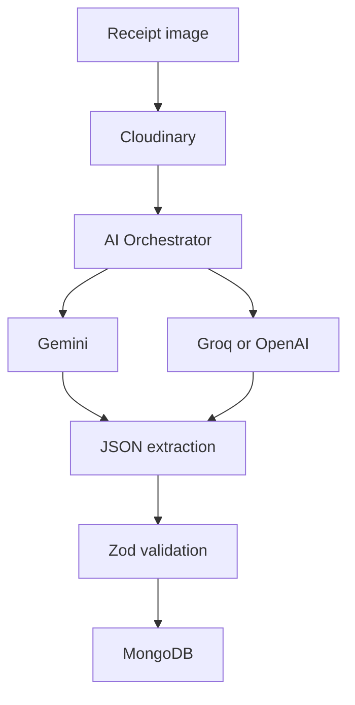

<p align="center">
  
</p>

<h1 align="center">💸 Pocket Planner</h1>
<h3 align="center">AI-assisted personal finance, receipts, analytics, and reports</h3>

<p align="center">
  
  
  
  
  
  
  
  
  
</p>

<p align="center">
  <b>Smarter money tracking in one place.</b><br/>
  Capture receipts, convert them to structured transactions, and explore insights with automated reporting.
</p>

---

## ✅ Highlights

- AI-assisted receipt capture with structured extraction
- Clean transaction workflows with categories and exports
- Insightful dashboards and automated reporting
- Secure auth with access and refresh tokens
- Modular backend and modern React client

---

## 📸 Screenshots

| Dashboard | Transactions | Reports |
|:---:|:---:|:---:|
| Add screenshot | Add screenshot | Add screenshot |

| Analytics | Receipt Capture | AI Extraction |
|:---:|:---:|:---:|
| Add screenshot | Add screenshot | Add screenshot |

---

## ✨ Features

### 💳 Core Finance
- Secure access and refresh token authentication
- Transaction management with categories and notes
- CSV import and export for bulk edits
- Recurring transactions and scheduled reports

### 🤖 AI and Automation
- Receipt scanning with AI extraction to JSON
- Validation and normalization before storage
- Multi-provider AI with fallback support

### 📊 Reporting and Insights
- Analytics dashboards and category summaries
- PDF report generation
- Scheduled email reports

### 🛠️ Developer Experience
- Type-safe APIs with Zod validation
- Modular services and clear route separation
- Optional demo user bootstrap for development

---

## 🧾 Usage Flow

1. Create an account (or enable the demo user in development).
2. Add transactions manually or upload a receipt image.
3. Review and confirm extracted fields before saving.
4. Explore analytics and category summaries.
5. Generate and email PDF reports on a schedule.

---

## 🧭 Architecture

```text
Client (React + Vite)
  -> API (Express + TypeScript)
     -> MongoDB (transactions, users, reports)
     -> Cloudinary (receipt images)
     -> AI Providers (Gemini primary, Groq/OpenAI fallback)
     -> Resend (report emails)
```



---


---

## 🧰 Tech Stack

| Layer | Technology |
|-------|-----------|
| Frontend | React, Vite, Tailwind CSS, Radix UI, Framer Motion |
| State and Data | Redux Toolkit, RTK Query |
| Backend | Node.js, Express, TypeScript |
| Database | MongoDB, Mongoose |
| Auth and Validation | Passport JWT, Zod |
| Media and Email | Cloudinary, Resend |
| Scheduling | node-cron |
| AI Providers | Gemini (primary), Groq and OpenAI (fallback) |
| Documents | jsPDF |

---

## 🧱 Project Structure

```text
POKET-PLANNER/
    backend/
        src/
            config/
            controllers/
            cron/
            mailers/
            models/
            routes/
            services/
            utils/
    client/
        src/
            app/
            components/
            features/
            pages/
```

---

## 🚀 Getting Started

### ✅ Prerequisites

- Node.js (LTS recommended)
- MongoDB (local or remote)

### 📦 Install Dependencies

```bash
cd backend
npm install

cd ../client
npm install
```

### 🔐 Environment Variables

Backend (`backend/.env`):

- `NODE_ENV` - Environment name (development, production).
- `PORT` - API port (default 8000).
- `BASE_PATH` - API base path (default `/api`).
- `MONGO_URI` - Primary MongoDB connection string.
- `MONGO_FALLBACK_URI` - Fallback MongoDB connection string.
- `DB_FALLBACK_ENABLED` - Enable fallback DB connection.
- `JWT_SECRET` - Access token secret.
- `JWT_EXPIRES_IN` - Access token TTL (default `15m`).
- `JWT_REFRESH_SECRET` - Refresh token secret.
- `JWT_REFRESH_EXPIRES_IN` - Refresh token TTL (default `7d`).
- `GEMINI_API_KEY`, `GEMINI_MODEL` - Gemini credentials and model name.
- `GROQ_API_KEY`, `GROQ_MODEL` - Groq credentials and model name.
- `OPENAI_API_KEY`, `OPENAI_MODEL` - OpenAI credentials and model name.
- `CLOUDINARY_CLOUD_NAME`, `CLOUDINARY_API_KEY`, `CLOUDINARY_API_SECRET` - Cloudinary credentials.
- `RESEND_API_KEY`, `RESEND_MAILER_SENDER` - Resend credentials and sender.
- `FRONTEND_ORIGIN` - Allowed origins for CORS (comma-separated).
- `SEED_DEMO_USER` - Enable demo user bootstrap.
- `DEMO_USER_NAME`, `DEMO_USER_EMAIL`, `DEMO_USER_PASSWORD` - Demo user credentials.

Frontend (`client/.env`):

- `VITE_API_URL` - Base URL for the backend API.
- `VITE_REDUX_PERSIST_KEY` - Key for state encryption.

### ▶️ Run Development

```bash
cd backend
npm run dev

cd ../client
npm run dev
```

### 🌐 Local URLs

| Service | URL |
|---------|-----|
| Client | http://localhost:5173 |
| API | http://localhost:8000/api |

Client defaults to `http://localhost:5173` and the API defaults to `http://localhost:8000` with base path `/api`.

---

## 🔒 Security Notes

- Never commit `.env` files or secrets.
- Use strong values for `JWT_SECRET` and `JWT_REFRESH_SECRET`.
- Set `FRONTEND_ORIGIN` to trusted domains only.
- Rotate provider keys if you suspect a leak.

---

## 🔌 API Reference

Base path: `/api` (configurable via `BASE_PATH`).

Route groups:

- `auth` - authentication and tokens
- `users` - user profile and settings
- `transactions` - transaction CRUD and imports
- `analytics` - dashboards and summaries
- `reports` - report generation and history

See `backend/src/routes` for exact endpoints.

---

## 🧪 Scripts

Backend:

- `npm run dev` - Start the API in watch mode.
- `npm run build` - Compile TypeScript to `dist`.
- `npm run start` - Run the compiled API.

Client:

- `npm run dev` - Start the Vite dev server.
- `npm run build` - Build the client.
- `npm run lint` - Run ESLint.
- `npm run preview` - Preview the production build.
